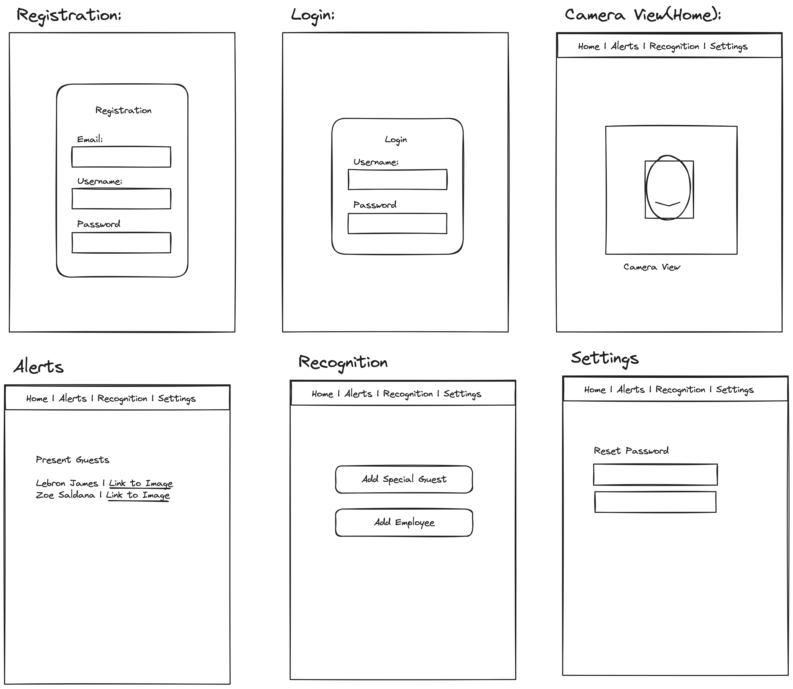
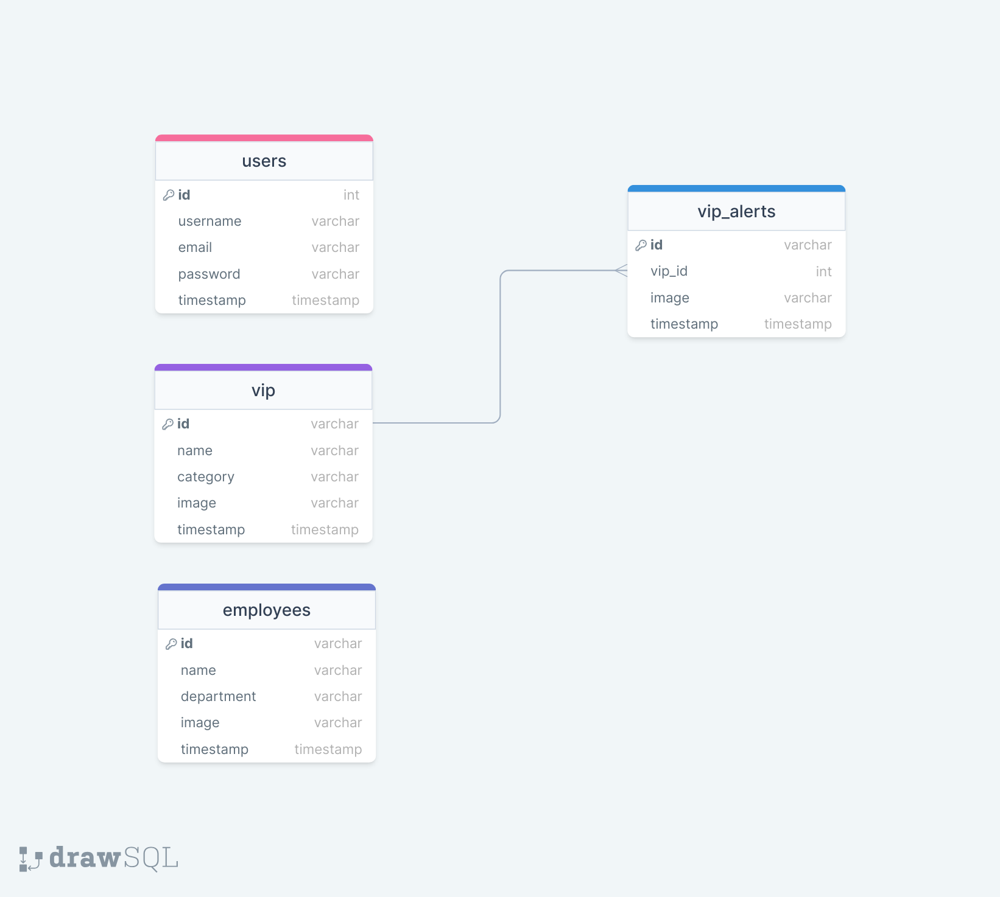

# Project Title
PrestigePro Facial Recognition

## Overview

The app aims to provide restaurants and hotels with a VIP recognition system using real-time facial recognition technology. It will identify celebrities, special guests, high-level social media influencers, and renowned restaurant reviewers to alert staff for providing exceptional service.

### Problem

Restaurants and hotels often struggle to identify VIP guests promptly, leading to missed opportunities for providing exceptional service and building relationships with influential individuals.

### User Profile

- Restaurant/hotel management staff:
    - use the app to receive alerts about VIP guests 
    - offer enhanced guest experiences

### Features

Logged users will have access to:
- Real-time Facial Recognition: Detect celebrities, influencers, and reviewers.
- VIP Alert System: Notify staff via email or SMS when a VIP is identified.
- See a list of celebrities onsite within the last 24 hours.
- Guest management: Allow user to add special guests and employee staff.
- User Management: Allow user to register accounts and manage access.

## Implementation

### Tech Stack

- React
- MySQL
- Express
- Client libraries: 
    - react
    - react-router
    - axios
- Server libraries:
    - knex
    - express
    - bcrypt for password hashing

### APIs

- face-api.js: for face detection and recognition
- Celebrity Recognition: AWS Rekognition
- SMS API: Twilio for sending SMS messages

### Sitemap

- Home page
- Register
- Login
- Camera View
- VIP Alerts Onsite
- Recognition Management
- Settings

### Mockup

### Data

Users: Staff accounts with authentication details
VIP Guests: Stored information for recognized VIPs
VIP Alerts: Stored information for alerts sent
Employees: Stored information for registered employees for facial recognition

### Endpoints

**POST /api/users/register**

- Register a new user.

Parameters:

- username (string): User's username
- email (string): User's email address
- password (string): User's password

Response:

{
  "message": "User successfully registered"
}

**POST /api/users/login**

- Log in an existing user.

Parameters:

- email (string): User's email address
- password (string): User's password

Response:

{
    "token": "JWT_TOKEN"
}

**GET /api/vips:id**

- Retrieve information about recognized VIP guests.

Response:

[{        
  "id": 1,        
  "name": "John Doe",        
  "category": "Celebrity",        
  "image": "https://example.com/john-doe.jpg"
},    
{         
  "id": 2,        
  "name": "Jane Smith",        
  "category": "Reviewer",        
  "image": "https://example.com/jane-smith.jpg"    
}]

**POST /api/vips**

- Add a new VIP guest.

Parameters:

- name (string): Name of the VIP guest
- category (string): Category of the VIP guest (e.g., Celebrity, Reviewer)
- image (string): URL to the image of the VIP guest

Response:

{
  "message": "VIP guest added successfully"
}

**DELETE /api/vips/:id**

- Remove a VIP guest.

Parameters:

- id (number): ID of the VIP guest to be removed

Response:

{
  "message": "VIP guest removed successfully"
}

**GET /api/vip-alerts**

- Retrieve information about alerts sent regarding recognized VIP guests.

Response:
[{
  "id": 1,
  "user_id": 1,
  "vip_id": 1,
  "employee_id": 2,
  "timestamp": "2024-03-27T10:15:00Z"
},
{
  "id": 2,
  "user_id": 2,
  "vip_id": 2,
  "employee_id": null,
  "timestamp": "2024-03-28T15:30:00Z"
}]

**GET /api/vip-alerts/:id**

- Retrieve information about a specific VIP alert.

Parameters:

- id (number): ID of the VIP alert to retrieve

Response:

{
  "id": 1,
  "vip_id": 1,
  "timestamp": "2024-03-27T10:15:00Z"
}

**POST /api/vip-alerts**

- Store information for alerts sent regarding recognized VIP guests.

Parameters:

- vip_id (number): ID of the recognized VIP guest triggering the alert
- timestamp (datetime): Timestamp of when the alert was sent

Response:

{
"message": "VIP alert stored successfully"
}

**DELETE /api/vip-alerts/:id**

- Remove a specific VIP alert.

Parameters:

- id (number): ID of the VIP alert to be removed

Response:

{
  "message": "VIP alert removed successfully"
}

**GET /api/employees**

Retrieve information about registered employees.

Response:
[{ 
  "id": 1, "name": "Amelia Taylor",        
  "department": "Front Desk",
  "image": "https://example.com/amelia-taylor.jpg"
},    
{        
  "id": 2,        
  "name": "Oliver Harris",        
  "department": "Kitchen",        
  "image": "https://example.com/oliver-harris.jpg"
}]

**POST /api/employees**

Add a new employee for facial recognition.

Parameters:

- name (string): Name of the employee
- department (string): Department of the employee (e.g., Front Desk, Kitchen)
- image (string): URL to the image of the employee

Response:

{
    "message": "Employee added successfully"
}

**DELETE /api/employees/:id**

Remove an employee.

Parameters:

- id (number): ID of the employee to be removed

Response:

{
    "message": "Employee removed successfully"
}

### Auth

JWT Authentication:
- JWT authentication will be implemented to secure API endpoints.
- Before adding authentication, all API requests will utilize a default user with ID 1 for testing purposes.
- Authentication will be added after the core features of the system have been initially implemented and tested.
- Upon successful login, the JWT token will be stored in the localStorage of the browser.
- The JWT token will be removed from localStorage when the user logs out.
- Different UI states will be implemented based on the user's authentication status to provide appropriate functionality and access control as depicted in the mockups.

## Roadmap

- Create client
  - Develop a React project with routes and boilerplate pages tailored for the VIP facial recognition system.

- Create server
  - Set up an Express project with routing and placeholder 200 responses to handle backend functionality.

- Create migrations
  - Implement database migrations to establish the necessary data structure for the VIP facial recognition system.

- Gather sample VIP facial data
  - Collect facial data of celebrities, influencers, reviewers, special guests, and employee staff.

- Create seeds with sample VIP facial data
  - Generate seeds containing sample VIP facial data to populate the database for testing and demonstration purposes.

- Deploy client and server projects
  - Deploy both the client and server projects to ensure all commits are reflected in the production environment.

- Feature: Real-time Facial Recognition
  - Implement facial recognition functionality to detect celebrities, influencers, and reviewers in real-time.

- Feature: VIP Alert System
  - Develop a system to notify staff via email or SMS when a VIP is identified.

- Feature: List of Celebrities Onsite
  - Create a page to display a list of celebrities onsite within the last 24 hours.
  - Implement backend logic to retrieve and display this information.

- Feature: Guest Management
  - Allow logged-in users to add special guests and employee staff to the system for facial recognition.
  - Implement frontend forms and backend endpoints to manage guest data.

- Feature: User Management
  - Develop user registration pages and forms to allow users to create accounts and manage access.
  - Implement backend endpoints for user authentication, registration, and access control.

- Bug fixes

- DEMO DAY

## Nice-to-haves

- Integration with restaurant management systems for seamless service coordination.
- Analytics dashboard for tracking VIP interactions, employee performance, and service effectiveness.
- Mobile app version for on-the-go access by staff.
- Reservation system integration.
