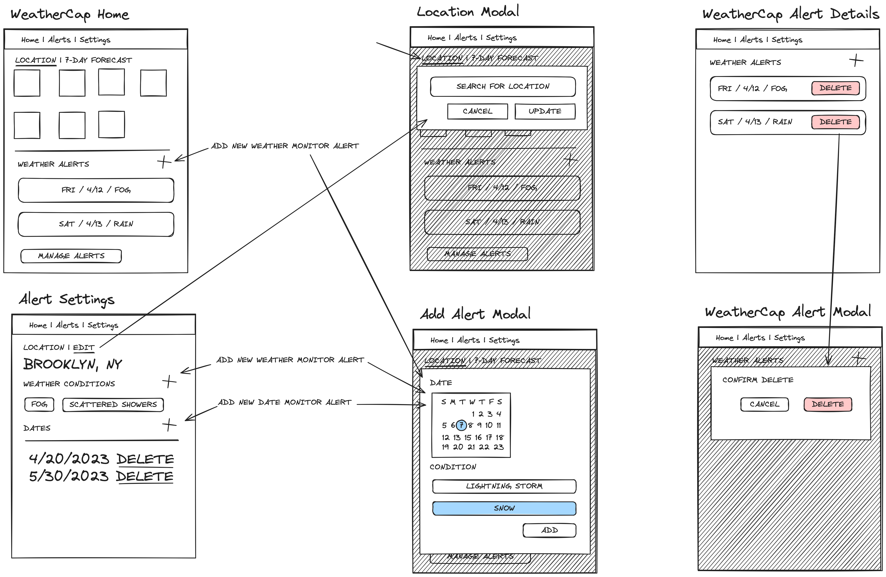
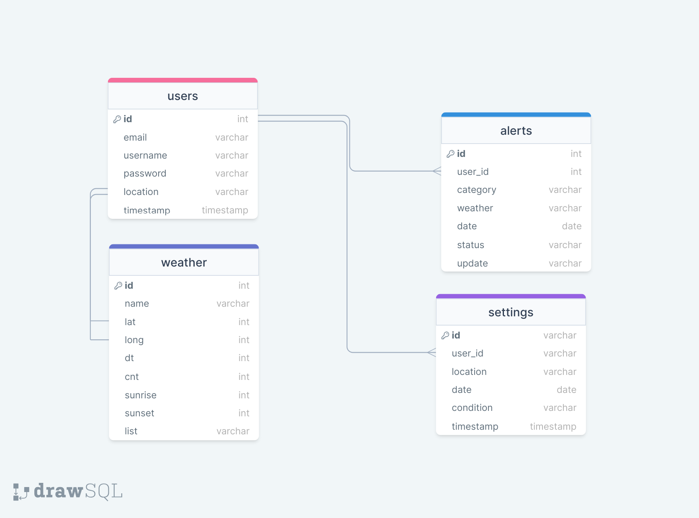

# Project Title
WeatherCap App

## Overview

WeatherCap is an app that photography enthusiasts can use to receive alerts for and track specific weather conditions.

### Problem

You've always wanted to take foggy photos of the Manhattan Bridge, a mirror photo of the Empire State building in a puddle after a rainstorm, or the perfect sunset shot with a partly cloudy sky. The program is that with a such a busy life, you forget to keep an eye out for the perfect weather conditions for a spontaneous photo outing.
Alternatively, you plan your next outing a week away, unaware that the weather has turned for the worse in the days between.

### User Profile

- Hobby Photographers:
    - be alerts to specific weather conditions happeing in the next 7 days
    - be alerts to weather changes for a specific date

### Features

- As a user, I want to be able to select my location
- As a user, I want to be able to select weather conditions to monitor for
- As a user, I want to be able to select a specific date to monitor weather changes for

- As a user, I want to be able to create an account to manage my alerts and alert settings

- As a logged in user, I want to be receive alerts when not logged in 
- As a logged in user, I want to be able retain settings after the browser is closed
- As a logged in user, I want to be able delete/dismiss alerts

## Implementation

### Tech Stack

- React
- MySQL
- Express
- Client libraries: 
    - react
    - react-router
    - axios
- Server libraries:
    - knex
    - express

### APIs

- OpenWeatherMap API: This API will provide current weather data, forecasts, and weather alerts for various locations worldwide.

### Sitemap

- Landing Page
- Register
- Login
- Dashboard
- Alert Settings
- Alert List

### Mockup

### Data

Forcast: Staff accounts with authentication details
Alerts: Stored information for recognized VIPs
Settings: Stored information for alerts sent
Register: Stored information for registered employees for facial recognition
Users:

### Endpoints

- Handle CRUD operations for user weather alert settings.

**POST /api/users/register**

- Register a new user.

Parameters:

- username (string): User's username
- email (string): User's email address
- password (string): User's password

Response:

{
  "message": "User successfully registered"
}

**POST /api/users/login**

- Log in an existing user.

Parameters:

- email (string): User's email address
- password (string): User's password

Response:

{
    "token": "JWT_TOKEN"
}

**GET /api/weather/forecast**

- Retrieve weather forcast information.

Response:

{
  "city": {
    "id": 3163858,
    "name": "Zocca",
    "coord": {
      "lon": 10.99,
      "lat": 44.34
    },
    "country": "IT",
    "population": 4593,
    "timezone": 7200
  },
  "cod": "200",
  "message": 0.0582563,
  "cnt": 7,
  "list": [
    {
      "dt": 1661857200,
      "sunrise": 1661834187,
      "sunset": 1661882248,
      "temp": {
        "day": 299.66,
        "min": 288.93,
        "max": 299.66,
        "night": 290.31,
        "eve": 297.16,
        "morn": 288.93
      },
      "feels_like": {
        "day": 299.66,
        "night": 290.3,
        "eve": 297.1,
        "morn": 288.73
      },
      "pressure": 1017,
      "humidity": 44,
      "weather": [
        {
          "id": 500,
          "main": "Rain",
          "description": "light rain",
          "icon": "10d"
        }
      ],
      "speed": 2.7,
      "deg": 209,
      "gust": 3.58,
      "clouds": 53,
      "pop": 0.7,
      "rain": 2.51
    },
    {
      "dt": 1661943600,
      "sunrise": 1661920656,
      "sunset": 1661968542,
      "temp": {
        "day": 295.76,
        "min": 287.73,
        "max": 295.76,
        "night": 289.37,
        "eve": 292.76,
        "morn": 287.73
      },
      "feels_like": {
        "day": 295.64,
        "night": 289.45,
        "eve": 292.97,
        "morn": 287.59
      },
      "pressure": 1014,
      "humidity": 60,
      "weather": [
        {
          "id": 500,
          "main": "Rain",
          "description": "light rain",
          "icon": "10d"
        }
      ],
      "speed": 2.29,
      "deg": 215,
      "gust": 3.27,
      "clouds": 66,
      "pop": 0.82,
      "rain": 5.32
    }]
}

**GET /api/users/:id/alerts**

- Retrieve weather alerts for logged in user

Response:

[{        
  "id": 1,    
  "user_id": 1,    
  "category": "condition",        
  "weather": "Fog",        
  "date": "1661943600",
  "status": "active",
  "update": "none"
},    
{         
  "id": 2,    
  "user_id": 2,    
  "category": "date",
  "weather": "Cloudy"  
  "date": "1661943600",   
  "status": "active",        
  "update": "none"    
}]

**POST /api/alerts/**

- Store information for alerts regarding weather settings.

Parameters:

- user_id (number): ID of the logged in user
- setting_id (number): ID of the associated weather alert setting
- timestamp (datetime): Timestamp of when the alert was sent

Response:

{
"message": "Weather alert stored successfully"
}

**DELETE /api/alerts/:id**

- Remove a weather alert.

Parameters:

- id (number): ID of the weather to be removed

Response:

{
  "message": "Weather alert removed successfully"
}

**GET /api/settings**

- Retrieve information about alerts selected by a user.

Response:
[{
  "id": 1,
  "user_id": 1,
  "location": [ "40.7128", "74.0060"],
  "category": "weather",
  "date": "2024-03-27",
  "condition": "fog",
  "timestamp": "2024-03-27T10:15:00Z"
},
{
  "id": 2,
  "user_id": 2,
  "vip_id": 2,
  "employee_id": null,
  "timestamp": "2024-03-28T15:30:00Z"
}]

**GET **GET /api/settings/:id**

- Retrieve information about a specific alert setting.

Parameters:

- id (number): ID of the weather alert to retrieve

Response:

{
  "id": 1,
  "user_id": 1,
  "location": [ "40.7128", "74.0060"],
  "category": "weather",
  "date": "2024-03-27",
  "condition": "fog",
  "timestamp": "2024-03-27T10:15:00Z"
}

**POST /api/settings/**

- Store setting information for alerts specified by user.

Parameters:

- user_id (number): ID of the user adding the alert
- timestamp (datetime): Timestamp of when the alert was added

Response:

{
"message": "Weather alert setting stored successfully"
}

**DELETE /api/settings/:id**

- Remove a specific weather alert setting.

Parameters:

- id (number): ID of the weather alert setting to be removed

Response:

{
  "message": "Weather alert setting removed successfully"
}

### Auth

JWT Authentication:
- JWT authentication will be implemented to secure API endpoints.
- Before adding authentication, all API requests will utilize a default user with ID 1 for testing purposes.
- Authentication will be added after the core features of the system have been initially implemented and tested.
- Upon successful login, the JWT token will be stored in the localStorage of the browser.
- The JWT token will be removed from localStorage when the user logs out.
- Different UI states will be implemented based on the user's authentication status to provide appropriate functionality and access control as depicted in the mockups.

## Roadmap

- Create client
  - Develop a React project with routes and boilerplate pages tailored for the VIP facial recognition system.

- Create server
  - Set up an Express project with routing and placeholder 200 responses to handle backend functionality.

- Create migrations
  - Implement database migrations to establish the necessary data structure for the VIP facial recognition system.

- Gather sample VIP facial data
  - Collect facial data of celebrities, influencers, reviewers, special guests, and employee staff.

- Create seeds with sample VIP facial data
  - Generate seeds containing sample VIP facial data to populate the database for testing and demonstration purposes.

- Deploy client and server projects
  - Deploy both the client and server projects to ensure all commits are reflected in the production environment.

- Feature: Real-time Facial Recognition
  - Implement facial recognition functionality to detect celebrities, influencers, and reviewers in real-time.

- Feature: VIP Alert System
  - Develop a system to notify staff via email or SMS when a VIP is identified.

- Feature: List of Celebrities Onsite
  - Create a page to display a list of celebrities onsite within the last 24 hours.
  - Implement backend logic to retrieve and display this information.

- Feature: Guest Management
  - Allow logged-in users to add special guests and employee staff to the system for facial recognition.
  - Implement frontend forms and backend endpoints to manage guest data.

- Feature: User Management
  - Develop user registration pages and forms to allow users to create accounts and manage access.
  - Implement backend endpoints for user authentication, registration, and access control.

- Bug fixes

- DEMO DAY

## Nice-to-haves

- Integration with restaurant management systems for seamless service coordination.
- Analytics dashboard for tracking VIP interactions, employee performance, and service effectiveness.
- Mobile app version for on-the-go access by staff.
- Reservation system integration.
