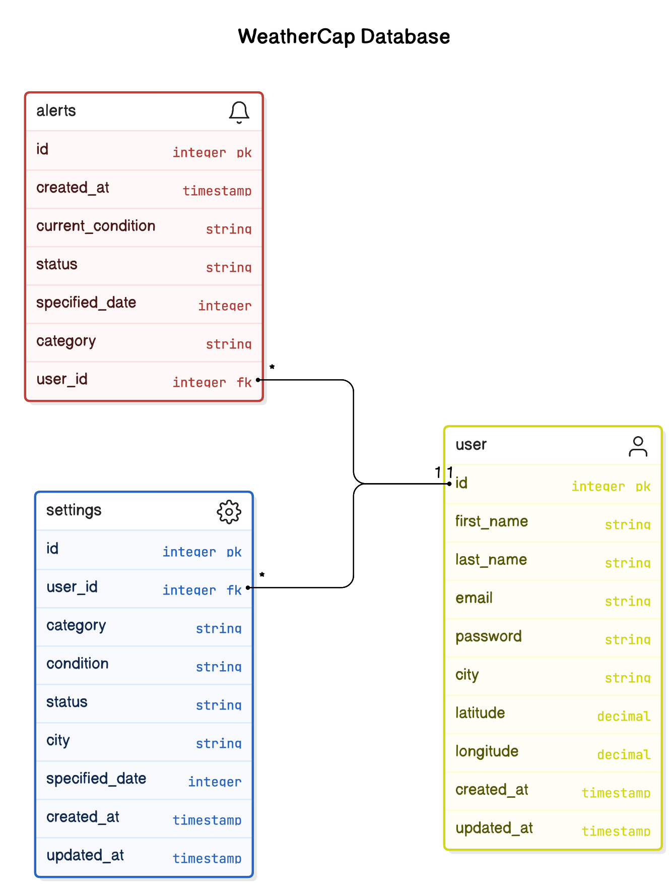

# Project Title
WeatherCap App

## Overview

For my BrainStation software development capstone, I developed WeatherCap—an app designed for photography enthusiasts to receive alerts and track specific weather conditions

### Problem

Have you ever dreamt of capturing foggy shots of the Manhattan Bridge, reflections of the Empire State Building in rain puddles, or the perfect sunset against a partly cloudy sky? The challenge lies in remembering to watch out for ideal weather conditions amidst life's busyness or planning an outing only to find unfavorable weather conditions on the day. WeatherCap solves this dilemma by keeping you informed and prepared for spontaneous or planned photo outings.

### User Profile

- Hobby Photographers:
    - be alerts to specific weather conditions happeing in the next 7 days
    - be alerts to weather changes for a specific date

### Features

As a user, I want to be able to:
- select my location
- receive a weather forecast
- create an account to manage my alerts and alert settings

As a logged in user, I want to be able to:
- select weather conditions to monitor for
- receive alerts when not logged in 
- retain settings after the browser is closed
- delete/dismiss alerts

## Implementation

### Tech Stack

- React
- MySQL
- Express
- Client libraries: 
    - react
    - react-dom
    - react-router-dom
    - axios
    - react-icons
    - react-places-autocomplete
    - jwt-decode
    - sass
- Server libraries:
    - express
    - knex
    - bcryptjs
    - jsonwebtoken
    - mysql2
    - node-fetch
    - cors
    - dotenv
    - node-cron
    - nodemon

### APIs

- OpenWeatherMap API: Provides current weather data and forecasts for various locations worldwide.
- Google Places API: Provides location search and latitude/longitude

### Sitemap

- Register
- Login
- Dashboard
    - Weather
    - Alerts
    - Settings

### Mockup

### Data

- User: User accounts with authentication details
- Alerts: Stored inforamtion for weather alerts
- Settings: Stored information for weather conditions to alert on

Users:

### Endpoints

**POST /api/users/register**

Register a new user.

Parameters:

    username (string): User's username
    email (string): User's email address
    password (string): User's password

Response:

    {
    "message": "User successfully registered"
    }

**POST /api/users/login**

Log in an existing user.

Parameters:

    email (string): User's email address
    password (string): User's password

Response:

    {
      "token": "JWT_TOKEN"
    }

**GET /api/weather/current/**

Retrieve current weather information.

Parameters:

    lat (number): Latitude
    lon (number): Longitude

Response (example):

    {
      "city": {
        "id": 3163858,
        "name": "Zocca",
        "coord": {
          "lon": 10.99,
          "lat": 44.34
        },
        "country": "IT",
        "population": 4593,
        "timezone": 7200
      },
      "cod": "200",
      "message": 0.0582563,
      "cnt": 7,
      "list": [
        {
          "dt": 1661857200,
          "sunrise": 1661834187,
          "sunset": 1661882248,
          ...
        },
        ...
      ]
    }

**GET /api/weather/forecast/**

Retrieve 7 day weather information.

Parameters:

    lat (number): Latitude
    lon (number): Longitude

Response (example):

    {
      // Current weather data
    }

**GET /api/alerts/user/:id/**
- Retrieve weather alerts for a specific logged-in user.

Parameters:

Response:

    [
      {        
        "id": 1,    
        "user_id": 2,    
        "category": "condition",        
        "weather": "Fog",        
        "date": "1661943600",
        "status": "active",
        "update": "none"
      },    
      {         
        "id": 2,    
        "user_id": 2,    
        "category": "date",
        "weather": "Cloudy",  
        "date": "1661943600",   
        "status": "active",        
        "update": "none"    
      }
    ]

**DELETE /api/alerts/:id**

Remove a weather alert.

Parameters:
- id (number): ID of the weather to be removed

Response:

    {
      "message": "Weather alert removed successfully"
    }

**GET /api/settings**

Retrieve all weather alert settings.

Response:

    [
      {
        "id": 1,
        "user_id": 1,
        "location": [ "40.7128", "74.0060"],
        "category": "weather",
        "date": "2024-03-27",
        "condition": "fog",
        "timestamp": "2024-03-27T10:15:00Z"
      },
      {
        "id": 2,
        "user_id": 2,
        "vip_id": 2,
        "employee_id": null,
        "timestamp": "2024-03-28T15:30:00Z"
      }
    ]

**GET /api/settings/user/:id**

Retrieve information about a specific alert setting.

Parameters:
- id (number): ID of the user whose weather alerts are to be retrieved

Response:

    [
      {
        "id": 1,
        "user_id": 1,
        ...
      },
      {
        "id": 2,
        "user_id": 1,
        ...
      }
    ]

**GET /api/settings/:id**

Retrieve information about a specific alert setting.

Parameters:
- id (number): ID of the weather alert to retrieve

Response:

    {
      "id": 1,
      "user_id": 1,
      "location": [ "40.7128", "74.0060"],
      "category": "weather",
      "date": "2024-03-27",
      "condition": "fog",
      "timestamp": "2024-03-27T10:15:00Z"
    }

**POST /api/settings/**

Store setting information for alerts specified by user.

Parameters:
- user_id (number): ID of the user adding the alert
- timestamp (datetime): Timestamp of when the alert was added

Response:

    {
      "message": "Weather alert setting stored successfully"
    }

**DELETE /api/settings/:id**

Remove a specific weather alert setting.

Parameters:
- id (number): ID of the weather alert setting to be removed

Response:

    {
      "message": "Weather alert setting removed successfully"
    }

### Auth

JWT Authentication:
- JWT authentication has been implemented to secure API endpoints.
- Upon successful login, the JWT token will be stored in the localStorage of the browser.
- The JWT token will be removed from localStorage when the user logs out.

## Roadmap

- Create client
  - Develop a React project with routes and boilerplate pages tailored for the VIP facial recognition system.

- Create server
  - Set up an Express project with routing and placeholder 200 responses to handle backend functionality.

- Create migrations
  - Implement database migrations to establish the necessary data structure for the VIP facial recognition system.

- Gather sample VIP facial data
  - Collect facial data of celebrities, influencers, reviewers, special guests, and employee staff.

- Create seeds with sample user, settings, and alert data
  - Generate seeds containing sample user, settings, and alert data to populate the database for testing and demonstration purposes.

- Deploy client and server projects
  - Deploy both the client and server projects to ensure all commits are reflected in the production environment.

- Feature: Real-time Weather Alerts
  - Implement weather alerts functionality to retrieve user settings, generate alerts, and display them in the front end interface

- Feature: User Management
  - Develop user registration pages and forms to allow users to create accounts and manage access.
  - Implement backend endpoints for user authentication, registration, and access control.

- Bug fixes

- DEMO DAY
